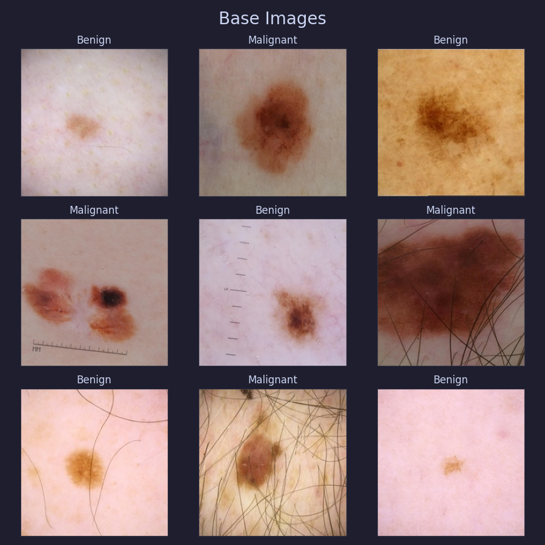
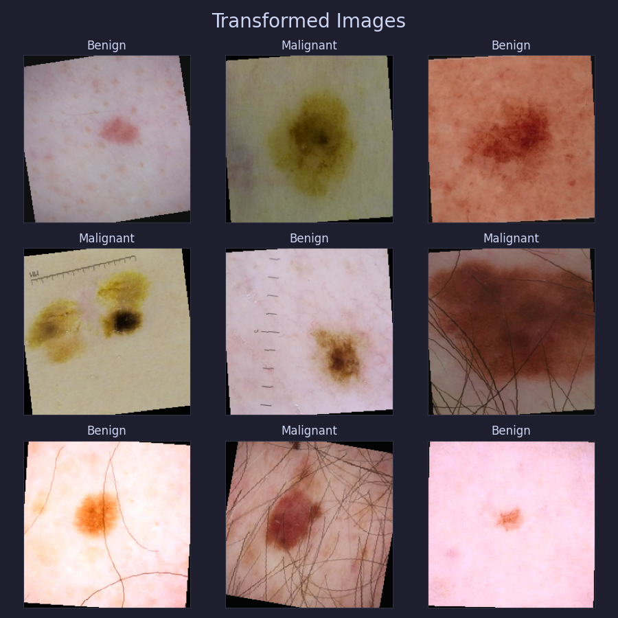
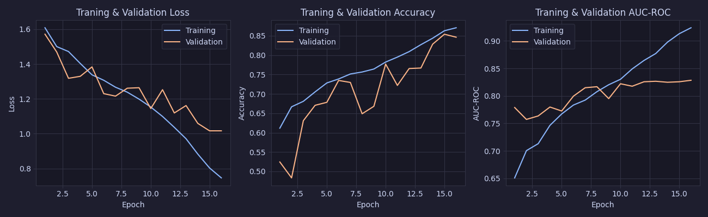
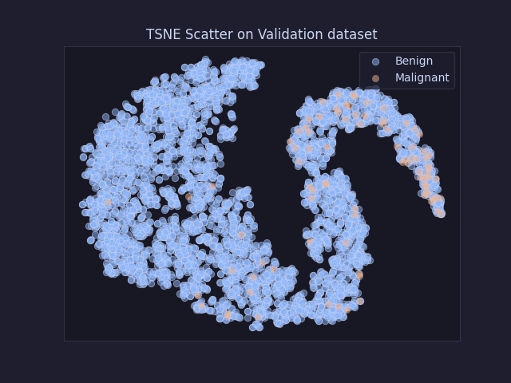
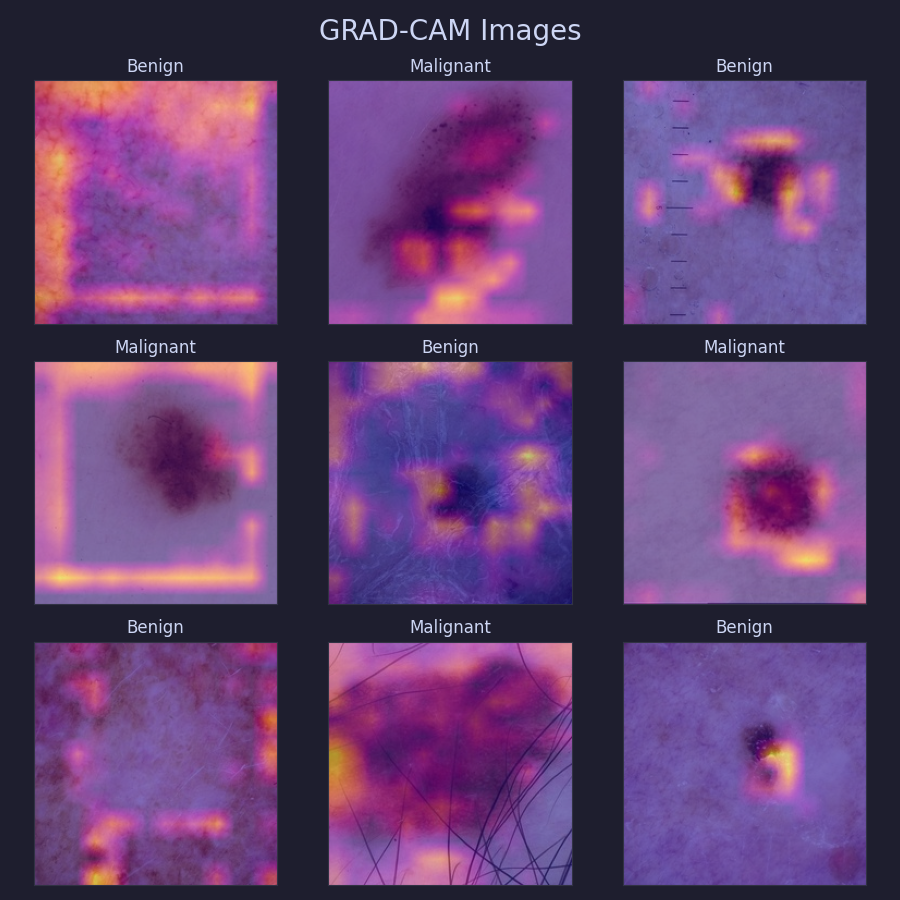
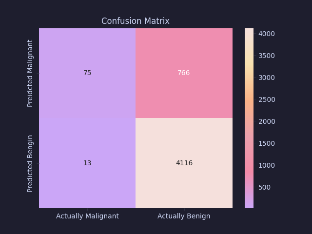
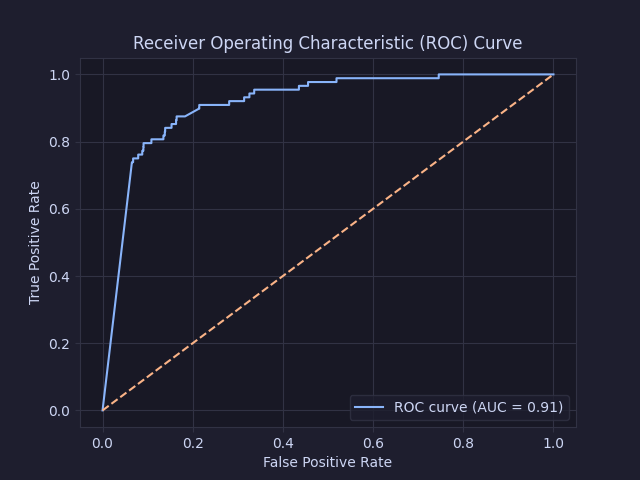
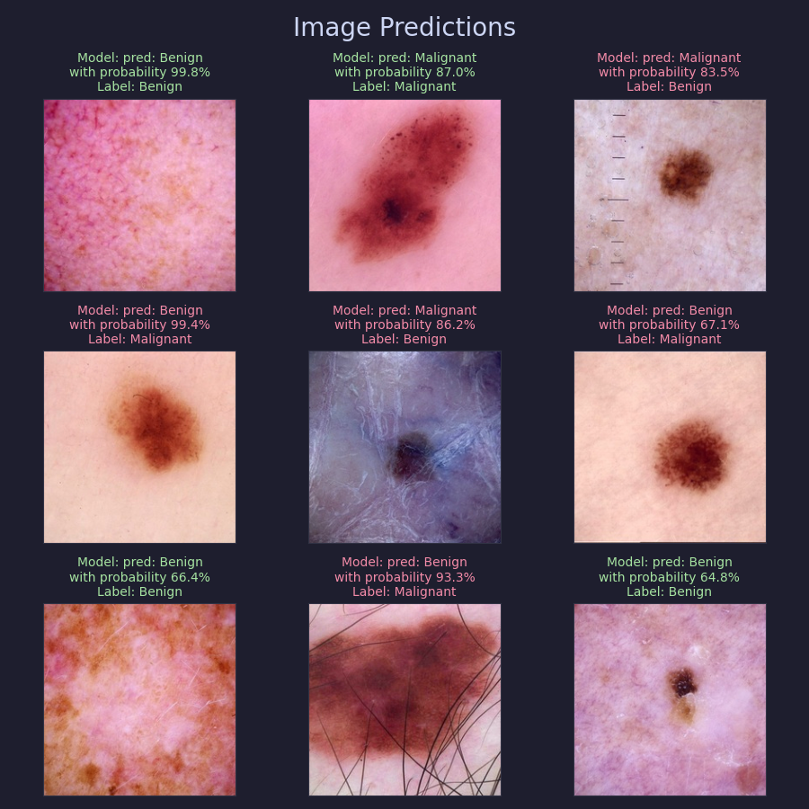

# Siamese Network to Classify Melanoma on Lesions (ISIC 2020)
## Project Description
For this project a Siamese model on the _ISIC 2020 Challenge dataset_  which aims to classify lesions as either benign or malignant was developed. The goal of the model is to achieve an accuracy of around 80% on the test dataset. The developed model will help dermatologists, who currently have to look through the lesions one by one, find early signs of skin cancer and assist with diagnosis.


## Dataset Description
The dataset is hosted [here](https://www.kaggle.com/competitions/siim-isic-melanoma-classification/overview) on Kaggle.  The dataset contains the following components:
- 33,126 images:
  * dimension: 1024x1024 
  * 32,542 images are benign (98.2% of all images)
  * 584 images are malignant (1.8% of all images)
- CSV file:
  * headers: ```image_name```, ```patient_id```, ```sex```, ```age_approx```, ```anatom_site_general_challenge```, ```diagnosis```, ```benign_malignant```, ```target```.
  * all of the meta data will be ignored in this project as we are only interested in classifying based on the images.
  * the ```target``` column is what we wish to predict
    * ```target == 0``` means the lesion is benign (harmless).
    * ```target == 1``` means the lesion is malignant (harmful).

Due to computation limits and redundancy in a high resolution 1024x1024 image the model was trained on a resized version of the dataset so all images are only 256x256. This resized dataset can be found [here](https://www.kaggle.com/datasets/nischaydnk/isic-2020-jpg-256x256-resized). Some sample images from the resized dataset across both classes are shown below:
<div style="text-align: center;">

</div>

## Enviroment Setup
Ensure you are in the ```47399811_siamese``` folder in the repository. If you are in the main directory of the repository, ```PatternAnalysis-2025``` run the following command:
```
cd recognition/47399811_siamese
```
to navigate to the correct directory.

### Adding the Dataset
Run the following commands to setup the directory for the data
```
mkdir data
mkdir data/images
```
Then download the dataset from [here](https://www.kaggle.com/datasets/nischaydnk/isic-2020-jpg-256x256-resized) and add all of the images in the ```data/images``` folder and add the CSV file named ```ISIC_2020_Training_GroundTruth.csv``` to the ```data``` folder.

### Pyhon Setup
Download ```Python 3.13.7``` from [here](https://www.python.org/downloads/). Then to install of the required packages run the following command:
```
py -m pip install -r requirements.txt
```
Which will install the following packages:
- ```catppuccin == 2.5.0```
- ```grad-cam == 1.5.5```
- ```matplotlib == 3.10.6```
- ```numpy == 2.2.6```
- ```pandas == 2.3.3```
- ```pillow == 11.0.0```
- ```scikit-learn == 1.7.2```
- ```scipy == 1.16.2```
- ```seaborn == 0.13.2```
- ```torch == 2.8.0+cu126```
- ```torchvision == 0.23.0+cu126```

## Data Preporation
_All of the data loading, splitting, oversampling, batching and augumentation are performaned in ```dataset.py``` in the ```ISICImageDataset``` class._   

The images in ```data/images``` are first split into benign or malignant (based on the label in ```data/ISIC_2020_TrainingGroundTruth.csv```). Then the dataset is split into the following 3 groups:
- __Train Set__: 
  * 70% of malignant images and 70% of benign images.
  * Used to train the model.
- __Validation Set__:
  * 15% of malignant images and 15% of benign images.
  * Used to validate the performance of the model and tune hyperparameters.
- __Test Set__:
  * 15% of malignant images and 15% of benign images.
  * Used to evaluate the models final performance on an unseen dataset.

The original dataset has a large class imbalance with very little malignant images compared to benign images (1.8% to 98.2%). So a major focus was on the how to counter act this class imbalance because otherwise our model would end up not predicting any malignant cases which would make it useless. So to counter act the class imbalance the minority class (malignant) was oversampled in the training data so there was 50% of each class. Furthermore, when iterating over the dataset in training the images would be batched with 50% of each class. 

To reduce over fitting multiple augmentations were applied to the images when training. The augmentations used in training are as follows:
-  ```RandomRotation(10)```: Rotates the image $\theta$ degrees where $\theta \in [0, 10]$. 
- ```RamdomVertialFlip()```: Flips the image vertically with a 50% probability.
- ```RandomHorizontalFlip()```: Flips the image horizontally with a 50% probability.
- ```ColorJitter(...)```: adjusts the brightness, contrast, saturation and hue of the image.

Additionally the pixel values of the images in training, validation and testing where normalised using ```Normalize(...)```. 

Here are some example images after the training transformations were applied:
<div style="text-align: center;">

</div>


## Model Architecture
_The model was implemented using ```Pytorch``` in ```modules.py```._  To print out the model architecture run the following command:
```
py modules.py
```

### Networks
The siamese network ```SiameseNetwork``` consists of a convolution neural network (CNN) backbone and a simple binary classifier. The CNN backbone takes in the images and produces some latent vector output. Then the binary classifier uses this latent vector output to classify the image. The latent vector is just some compact representation of the image which highlights/extracts the important features of the image which will be used for classification.

For this project a slightly modified ```restnet18``` was used for the CNN backbone of the siamese network. The ```resnet18```'s architecture is shown below:

<div style="text-align: center;">


<em>Original ResNet-18 Architecture (Farheen et al., 2019)</em>
</div>


For this project the last fully connected layer and softmax have been removed, as only the CNN part of the model is needed. As can be seen above this model will output a 512 dimensional latent vector representation of an image.

The binary classifier consists of 4 fully connected layers of size: $512 \to 256 \to 128 \to 64 \to 2$ with a ```RelU``` activation function and ```Dropout(0.5)``` between each fully connected layer. The final layer output has two values; the first being the models confidence that the image is benign (```label==0```) and the second is the models confidence the image is malignant (```label==1```). The models confidence in each label are used to generate its predictions. The dropout layers in the classifier help to reduce over fitting in the model by randomly turning off 50% of the nodes in each layer.

### Loss Functions
The goal of the CNN backbone is to make the latent vectors of two images of the same label close together and the latent vectors of two image with different labels far apart. To achieve this the ```TripletMarginLoss``` was used to evaluate the CNN's performance. The triplet loss works by randomly choosing 2 other images $\mathcal{P}$ and $\mathcal{N}$ for each anchor image $\mathcal{A}$ such that the label of $\mathcal{A}$ and $\mathcal{P}$ are the same while the label of $\mathcal{N}$ differs. Then the loss rewards the latent vectors for $\mathcal{A}$ and $\mathcal{P}$ being close together and $\mathcal{A}$ and $\mathcal{N}$ being far apart. Formally the triplet loss function on a batch of size $M$ can be defined as follows,

$$
L(\mathbf{a}, \mathbf{p}, \mathbf{n}) := \max\_{i\in[1,\ldots,M]} \left[\underbrace{\|\mathbf{a}\_i - 	\mathbf{p}\_i \|}\_{\text{distance between two images of the same label}} - \underbrace{\|\mathbf{a}\_i - \mathbf{n}\_i \|}\_{\text{distance between two images of different labels}} + \text{margin}, 0\right].
$$

where: 
- $\mathbf{a} := (\mathbf{a}\_1, \ldots, 	\mathbf{a}\_M)$ where $\mathbf{a}\_i$ is the latent vector output of the CNN on the $i^{\text{th}}$ anchor image in the batch.
- $\mathbf{p} := (\mathbf{p}\_1, \ldots, 	\mathbf{p}\_M)$ where $\mathbf{p}\_i$ is the latent vector output of the CNN on a chosen _positive_ image which has the same label as $\mathbf{a}\_i$.
- $\mathbf{n} := (\mathbf{n}\_1, \ldots, 	\mathbf{n}\_M)$ where $\mathbf{n}\_i$ is the latent vector output of the CNN on a chosen _negative_ image which has a different label than $\mathbf{a}\_i$.

For this project we have also chosen $\text{margin} = 1$ (which is a common choice).

The goal of the binary classifier is to correctly classify the images from their latent vectors as either benign or malignant. So to achieve this ```CrossEntropyLoss``` is used, cross entropy loss measures how close the models probability distribution for the labels is to the true labels. To define the Cross Entropy Loss we must first define the models probability distribution from its confidence output in the final layer of the classifier. This can be achieved using the $\text{softmax}$ function, that is, if we let $(c\_0, c\_1)$ be the classifiers output (the models confidence in benign and malignant respectfully) then we can define the classifiers probability of the image being benign $p\_0$ or malignant $p\_1$ as follows:

$$
p\_0:=\text{softmax}(c\_0) = \frac{e^{c\_0}}{e^{c\_0}+e^{c\_1}}, \hspace{1cm} p\_1 := \text{softmax}(c\_1) = \frac{e^{c\_1}}{e^{c\_0} + e^{c\_1}}.
$$

Then using these probabilities we define Cross Entropy Loss ($\text{CE}$) on a batch of size $M$ for true labels $\mathbf{y} = (y\_1, \ldots, y\_M)$ as,

$$
CE = -\frac{1}{M}\sum\_{i=1}^M \left[y\_i\cdot \log(p\_{i,0}) +  (1-y\_i)\log(p\_{i,1}) \right],
$$

where $p\_{i,\ell}$ is the models probability of the $i^{\text{th}}$ images label being $\ell$.

Finally the loss of the model is just the sum of the ```TripletMarginLoss``` to evaluate the backbone and ```CrossEntropyLoss``` to evaluate the binary classifier. We want both networks to train simultaneously and equally so they have to be combined into a single loss function.

## Training
_The model was trained using functions in ```train.py```._ To train the model run the following command:
```
py train.py 
```

The following hyperparameters have been used to train the model:
- ```batch_size=32```
- ```epochs=16```
- ```learning_rate=0.01```, with a learning rate scheduler, ```CosineAnnealingLR```, set to ```T_max=25, eta_min=1e-7```
  - Using a learning rate scheduler helps the model to explore a little more with a higher learning rate initially while still being able to converge and fine tune at the higher epochs.


### Training Results
The models loss, accuracy and AUC-ROC score during training has been plotted for each epoch as shown below:
<div style="text-align: center;">

</div>

**Analysis**:
- Validation loss is closely following the training loss which means the model is correctly generalising and is unlikely to be overfit.
- Near the end of training the models training loss continues to drop rapidly while the validation loss stabilises. This shows the training was terminated at the right time before the model would start to overfit.
- The models training and validation accuracy closely followed each other meaning there was good generalisations in the models predictions.
- The models training AUC-ROC value was rapidly increasing towards 1 while the validation score did not increase as much. This shows the model was able to build a lot more confidence in its predictions on the training set when compared to the validation set.

The t-SNE plot on the validation set is shown below:
<div style="text-align: center;">

</div>

**Analysis**:
- Some good separation can be seen between the two classes, as a most of the malignant images are pooled together at the end of the shape (to the right). While the benign images are mostly all grouped together in the large blob on the left end.
- While there is still a fair bit of overlap between the two classes this comes as a side effect of projecting the 512 dimensional latent vectors into a 2D plane. 

## Evaluation
_The model was evaluated using the functions in ```predict.py```._ To evaluate the model run the following command:
```
py evaluate.py 
```
### Figures
To evaluate the reasonableness of the CNN backbone it is useful to know what the model is looking at in these images to extract its features (the latent vectors). Because it could be _cheating_ by using some unintended artifact in the images or not correctly highlighting the lesions in the image. To check the models reasonableness we can look at the output of GRAD-CAM on a random sample of images from the dataset:
<div style="text-align: center;">

</div>

**Analysis**:
- The areas in the image where the overlay is brightest are where the CNN is looking at the most when extracting its features.
- The model, for the most part, is seen to be looking at the lesions. This is good as this should be what is used to distinguish one image as either benign or malignant.
- While sometimes model is not able to highlight the lesions this is potentially a sign the model was overfit, insufficiently trained or too simple to pick up on every lesion. 
- Clearly the model is not _cheating_ as it is not highlighting some obscure part of every single image.

The confusion matrix of the models predictions on the hidden test dataset is shown below:
<div style="text-align: center;">

</div>

**Analysis**:
- Overall accuracy $=\frac{75+4116}{75+4116+766+13} = 84.3$%.
- Accuracy on malignant data $=\frac{75}{75+13} = 85.2$%.
- Accuracy on benign data $=\frac{4116}{4116+766} = 84.3$%.
- Therefore the model has met the accuracy requirement of around $80$% as it is getting higher than $80$% overall and on each class.
- The model has a very similar accuracy on both malignant and benign images indicating the model was well balanced and the natural imbalance in the data set was successfully counter acted.

The models ROC curve on the hidden test dataset is shown below:
<div style="text-align: center;">

</div>

**Analysis**:
- The AUC-ROC score measures the models flexibility under various thresholds for its predictions. So the higher the AUC-ROC (with a max of 1) the more confident your model is in its predictions. 
- $AUC= 0.91$ shows the model has a high level of confidence on its predictions on the test data. Which is what we want because the models predictions will then likely be more stable and robust on unknown data.

Some sample model predictions are shown below:
<div style="text-align: center;">

</div>

**Analysis**:
- Showcases example images of true positive, false positive, true negative and false negative model predictions.
- It can be seen that when the GRAD-CAM was not able to correctly highlight the lesions this is what lead to the model having worse predictions.
- This means the incorrect predictions might be more likely caused by the CNN backbone not being able to highlight the lesions rather than the binary classifier.

### Summary
Overall the model was able to perform very well and hit the roughly $80$% requirement set on the test data. The models predictions are accurate on the test data, having a $84.4$% accuracy, and is very confident/robust as shown by the high $AUC$ value of $0.91$. However, a few issues were observed with the CNN backbone not being able to highlight the lesion on some images (as seen in the GRAD-CAM images) which often lead to an incorrect prediction (as seen in the image predictions).

## Improvements and Future Directions
- **Add meta-data**: In the _ISIC 2020 Kaggle Challenge_ some additional meta-data was released along with the images and labels. These include the ```sex``` and ```age_approx``` of the patient. A model which also incorporates this meta-data into its classifications could be developed.
- **Using other backbone CNN's**: for this project ```restnet18``` was the only CNN tested. However, some other CNNs could be used for the backbone which could lead to better results. Other, maybe more complex, CNN's could also help to resolve the issue with the current solution not being able to pickout the lesion for some images.
- **SMOTE**: SMOTE is another technique which could be used to counteract the class imbalance in the dataset by creating new fabricated images instead of just oversampling the same image. This could lead to stronger generalisation on the whole dataset as it is not seeing the exact same image as much.
- **Data Augmentations:** Other data augmentations could be used to help with generalisation and reduce over fitting in the model. Due to the time limit of this project there was not enough time to fine-tune and get more consistent results with more complex augmentations. Adding more augmentations would also help counteract the class imbalance and make the model more robust.

## References
- https://www.kaggle.com/datasets/nischaydnk/isic-2020-jpg-256x256-resized/data
- https://www.researchgate.net/figure/Original-ResNet-18-Architecture_fig1_336642248
- https://github.com/jacobgil/pytorch-grad-cam
- https://pytorch.org/
- https://medium.com/analytics-vidhya/a-friendly-introduction-to-siamese-networks-283f31bf38cd
- https://catppuccin.com/
- https://www.geeksforgeeks.org/machine-learning/auc-roc-curve/
- https://docs.pytorch.org/docs/stable/generated/torch.nn.TripletMarginLoss.html
- https://www.geeksforgeeks.org/deep-learning/binary-cross-entropy-log-loss-for-binary-classification/
